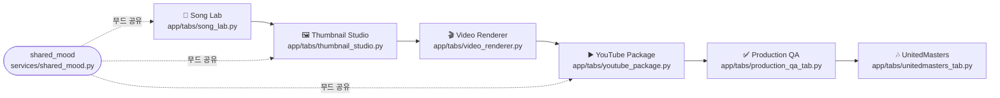
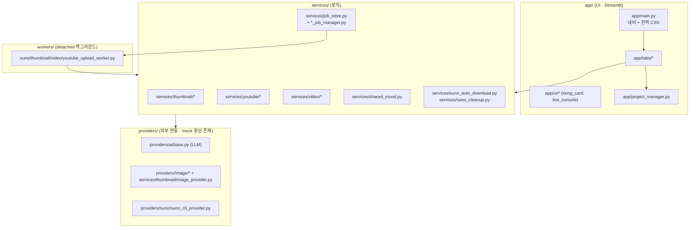

# ARCHITECTURE.md — 에이전트용 좌표(Cartography)

> 이건 **에이전트용 지도**다(사람용 설명은 `README.md`, 지침·취향은 `CLAUDE.md`, 함정은 `AGENTS.md`).
> 목적: 매 세션 신입인 에이전트가 **어디서 무엇이 무엇을 부르는지**를 한 눈에 잡게 하는 것.

## 파이프라인 (제품 흐름 = main.py 내비 순서)

## 레이어 의존 (위에서 아래로만 의존)

## 핵심 데이터 흐름 (에이전트가 자주 헷갈리는 것)

- **무거운 생성은 절대 동기 실행 안 함.** UI가 `*_job_manager.start_*_job()` → `services/job_store.py`에
  잡 생성 → **detached `workers/*`** 프로세스가 실제 생성 → job_store 폴링으로 UI가 진행률 표시.
  한 번에 하나만 running, 나머지 queued→자동 chain. (이유: Streamlit rerun이 실행 중 스크립트를 끊음.)
- **썸네일**: `thumbnail_studio.py` → `prompt_generator`/`prompt_composer`(프롬프트) →
  `image_provider.get_image_provider(engine)` → `session_store`(후보 저장). `job["project"]`=session_id.
- **곡 다운로드**: 생성 직후 worker가 `suno_auto_download.auto_download_final_version`(승자 1개 저장 +
  나머지 Suno에서 삭제, 기본 ON).
- **YouTube 설명**: `youtube_package.py` → `services/youtube/seo_description.py`(골격) +
  `metadata_generator`/`description_translator`(LLM, OpenAI→Gemini). 트랙리스트는 업로드 음원에서 그대로.
- **무드**: `providers/ai/base.SONG_MOODS`(곡) · `prompt_generator.THUMB_ART_STYLES`(썸네일) ·
  `services/shared_mood`로 곡·썸네일·YouTube가 하나의 무드 공유.

## 진입점 (Entry Points)

| 무엇 | 파일 |
|---|---|
| 앱 진입점 | `app/main.py` (내비 → 각 `app/tabs/*` 렌더 함수 호출) |
| 백그라운드 워커 | `python -m workers.<name>_worker <job_id>` (detached) |
| 잡 상태 저장소 | `services/job_store.py` (파일 기반) |
| 테스트 | `tests/test_*_vNNN.py` (기능당 1파일) |

## Cross-Module 의존 요약

- `app/tabs/*` → `services/*` (로직) + `app/project_manager.py`(프로젝트 CRUD).
- `services/*` → `providers/*`(외부 API, 키는 env 전용) — 항상 mock 폴백 존재.
- `services/*_job_manager.py` → `workers/*`(subprocess.Popen, DETACHED) → 다시 `services/*` 호출.
- 공유 지점: `job_store`(모든 잡), `shared_mood`(무드), `library_labels`(라벨), `session_store`(썸네일 후보).

> ⚠️ 데드코드 주의: 과거 `app/tabs/tabN_*.py`는 **삭제됨**(가짜 진입점). 실제 탭은 위 표의 파일들.
> `agents/`·`app/orchestrator.py`는 라이브 앱이 거의 안 쓰는 레거시 경로(수정 전 사용처 확인).
